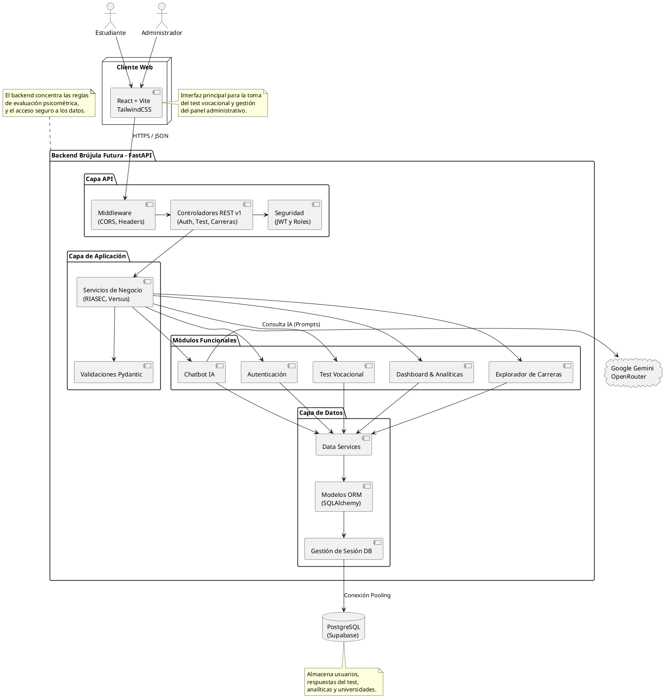

# Brújula Futura - Sistema de Orientación Vocacional

## Descripción General

Brújula Futura es una plataforma integral de orientación vocacional diseñada para ayudar a los estudiantes a descubrir y explorar carreras profesionales alineadas con sus aptitudes y preferencias. El sistema utiliza inteligencia artificial para analizar las respuestas de los usuarios a través de pruebas psicométricas y generar recomendaciones personalizadas.

## Diagrama de Arquitectura

A continuación, se detalla la arquitectura del sistema. Puede generar el diagrama utilizando el siguiente código en PlantUML:

## Estructura del Proyecto

El repositorio está dividido en dos aplicaciones principales:

- `frontend/` (Raíz del proyecto src/): Aplicación cliente desarrollada en React.
- `backend/`: API desarrollada en Python con FastAPI.

## Instalación y Configuración

### Requisitos Previos

- Node.js (v18 o superior)
- Python (v3.9 o superior)
- PostgreSQL (o instancia de Supabase)

### Configuración del Backend

1. Navegar al directorio del backend: `cd backend`
2. Crear un entorno virtual: `python -m venv venv`
3. Activar el entorno virtual:
   - Windows: `venv\Scripts\activate`
   - Linux/Mac: `source venv/bin/activate`
4. Instalar las dependencias: `pip install -r requirements.txt`
5. Crear archivo `.env` basado en la configuración del entorno.
6. Iniciar el servidor de desarrollo: `uvicorn app.main:app --reload`

### Configuración del Frontend

1. Navegar a la raíz del proyecto.
2. Instalar dependencias: `npm install`
3. Crear archivo `.env` con la URL de la API (ej. `VITE_API_URL=http://localhost:8000/api`).
4. Iniciar el servidor de desarrollo: `npm run dev`

## Dependencias de Código Abierto y Licencias

Este proyecto utiliza diversas bibliotecas y frameworks de código abierto. Para cumplir con los requerimientos legales y de distribución, a continuación se detallan las principales dependencias utilizadas y sus respectivas licencias:

### Frontend
- **React** y **React DOM**: Licencia MIT
- **React Router DOM**: Licencia MIT
- **Vite**: Licencia MIT
- **TailwindCSS**: Licencia MIT
- **Framer Motion**: Licencia MIT
- **Recharts**: Licencia MIT
- **Lucide React**: Licencia ISC
- **Lodash**: Licencia MIT
- **Sonner**: Licencia MIT

### Backend
- **FastAPI**: Licencia MIT
- **Uvicorn**: Licencia BSD
- **SQLAlchemy**: Licencia MIT
- **Psycopg2-binary**: Licencia LGPL / ZPL
- **Pydantic**: Licencia MIT
- **Python-jose (Autenticación JWT)**: Licencia MIT
- **Passlib (Hashing de contraseñas)**: Licencia BSD
- **Google Generative AI**: Licencia Apache 2.0
- **Supabase-py**: Licencia MIT

Todos los derechos de las bibliotecas mencionadas pertenecen a sus respectivos autores. El uso de estas herramientas está sujeto a las condiciones establecidas por las licencias MIT, BSD, ISC, LGPL y Apache 2.0, las cuales permiten el uso comercial y modificación del código bajo la premisa de mantener los avisos de copyright originales.

## Licencia del Proyecto

Este software ha sido desarrollado para el proyecto "Brújula Futura" en colaboración con Fe y Alegría. Todos los derechos reservados bajo la Licencia MIT (ver archivo LICENSE).
