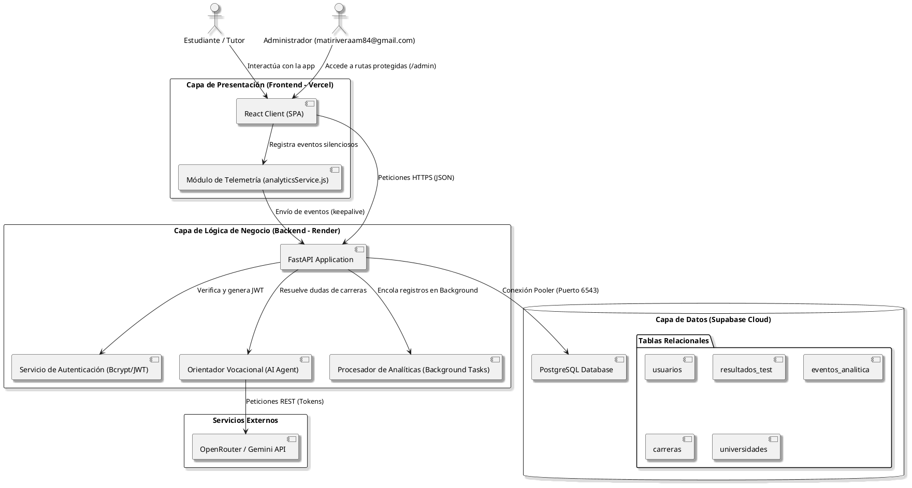

# Brújula Futura (PUCE 2026-01)

> Herramienta de orientación vocacional inteligente y telemetría de uso para estudiantes de bachillerato en Ecuador.

[](https://brujula-futura.vercel.app)
[](https://react.dev)
[](https://fastapi.tiangolo.com)
[](https://supabase.com)
[](LICENSE)

---

## 📋 Descripción del Proyecto

**Brújula Futura** es una plataforma web de orientación vocacional orientada a estudiantes de bachillerato en el Ecuador, con especial foco en los centros educativos de **Fe y Alegría**. Combina un test psicométrico interactivo basado en el modelo **RIASEC de Holland**, un catálogo de exploración y comparación de oferta académica ecuatoriana, un chatbot interactivo potenciado por Inteligencia Artificial para resolver dudas de carreras y un panel administrativo exclusivo para visualización de KPIs y analíticas en tiempo real.

---

## 👥 Integrantes y Roles

| Nombre | Rol principal | Responsabilidades |
| :--- | :--- | :--- |
| **Mathias Rivera** | Líder Técnico & Infraestructura | Configuración de entornos, despliegue continuo (CI/CD), seguridad JWT, persistencia ORM y automatización de base de datos. |
| **Emily Flores** | Product Owner & Documentación | Diseño de UI/UX, investigación de campo, redacción del manual de usuario y validaciones. |
| **William** | Desarrollador de Base de Datos | Diseño Entidad-Relación, triggers y funciones SQL, estructuración de seed data y videos de funcionamiento. |
| **Gustavo** | Scrum Master & Plan Financiero | Gestión ágil, análisis financiero (VAN, TIR), costos de sostenibilidad y redacción del plan de negocios. |

---

## 🛠 Stack Tecnológico

*   **Frontend**: React 19 + Vite 8.
*   **Diseño y Visualizaciones**: Vanilla CSS (Design System responsivo y glassmórfico), Recharts (Gráficos interactivos de analítica), Lucide Icons.
*   **Backend**: FastAPI (Python 3.11/3.12), SQLAlchemy 2.0 (ORM), Uvicorn (Servidor ASGI), Passlib (Bcrypt para encriptación de claves) y Jose (Generación y validación de tokens JWT).
*   **Base de Datos**: Supabase (PostgreSQL 15 Cloud) operando con triggers PL/pgSQL y soporte relacional.
*   **Servicio de Inteligencia Artificial**: Integración REST con modelos LLM a través de la API de OpenRouter / Google Gemini.

---

## 📐 Arquitectura Técnica (Diagrama PlantUML)

El sistema implementa una arquitectura cliente-servidor desacoplada que asegura la escalabilidad e independencia de capas.

### Código de PlantUML del Diagrama de Componentes

Puedes generar el diagrama visual en cualquier visor de PlantUML pegando el siguiente código:



---

## 📁 Estructura del Repositorio

```text
proyecto-brujula-futura/
├── backend/                  # Código fuente del Servidor (FastAPI)
│   ├── app/
│   │   ├── api/              # Endpoints (auth, carreras, admin, analytics, chat)
│   │   ├── core/             # Configuración central, seguridad y base de datos
│   │   ├── models/           # Modelos ORM de SQLAlchemy
│   │   └── schemas/          # Modelos Pydantic (Validación de entrada/salida)
│   │   └── main.py           # Punto de entrada de FastAPI
│   ├── .env.example          # Variables de entorno requeridas
│   └── requirements.txt      # Dependencias de Python
├── db_scripts/               # Scripts SQL de base de datos y utilidades
│   ├── 01_brujula_futura_schema.sql  # Esquema básico relacional
│   ├── 02_analytics.sql              # Estructura del motor de analíticas
│   ├── 02_brujula_futura_seed.sql    # Datos semilla de carreras, preguntas y unis
│   ├── 03_crear_tabla_resultados.sql # Historial de resultados
│   └── migrate_supabase.py           # Script de clonación automática de BD
├── src/                      # Código fuente del Cliente (React)
│   ├── components/           # Componentes UI (Navbar, Route Guards, loaders)
│   ├── context/              # Contexto global de sesión (AuthContext)
│   ├── pages/                # Páginas (Home, Test, Explorar, Admin, Login)
│   ├── services/             # Clientes de API (api.js, analyticsService.js)
│   ├── App.jsx               # Enrutamiento de la aplicación
│   └── main.jsx              # Renderizador de React DOM
├── package.json              # Dependencias del Frontend
├── vite.config.js            # Configuración de empaquetado de Vite
├── LICENSE                   # Licencia MIT del proyecto
└── README.md                 # Documentación técnica general
```

---

## 🚀 Guía de Instalación y Ejecución Local

### 1. Requisitos Previos
*   **Node.js** (versión 18.0.0 o superior)
*   **Python** (versión 3.11 o superior)
*   **Base de datos PostgreSQL** o una cuenta activa en **Supabase**

---

### 2. Configuración del Backend

1. Entra a la carpeta del backend:
   ```bash
   cd backend
   ```
2. Crea un entorno virtual e instálalo:
   ```bash
   # En Windows:
   python -m venv venv
   .\venv\Scripts\activate
   
   # Instalar dependencias
   pip install -r requirements.txt
   ```
3. Crea un archivo `.env` tomando como base `.env.example`:
   ```env
   DATABASE_URL=postgresql://tu_usuario:tu_clave@tu_servidor:6543/postgres
   SECRET_KEY=clave_secreta_para_firmar_jwt
   OPENAI_API_KEY=tu_clave_de_openrouter
   ```
4. Ejecuta el servidor de desarrollo:
   ```bash
   uvicorn app.main:app --reload
   ```
   El backend estará disponible en `http://localhost:8000`. Puedes probar el API interactivo en `http://localhost:8000/docs`.

---

### 3. Configuración del Frontend

1. Desde la raíz del repositorio, instala los paquetes de Node:
   ```bash
   npm install
   ```
2. Inicia el servidor de desarrollo de Vite:
   ```bash
   npm run dev
   ```
3. Abre el explorador en `http://localhost:5173`.

---

## 📊 Diccionario de Datos Relacional (Resumido)

*   **`usuarios`**: Almacena las credenciales y el estado de los alumnos y administradores.
*   **`roles_usuario`**: Especifica los privilegios (`ADM` para panel de control, `EST` para test vocacional).
*   **`perfiles_estudiante`**: Datos demográficos y objetivos de bachillerato.
*   **`areas_vocacionales`**: Estructura de las 6 áreas del modelo psicométrico RIASEC.
*   **`preguntas_test` / `opciones_test`**: Banco de preguntas parametrizado con sus respectivos coeficientes de afinidad.
*   **`carreras` / `universidades` / `carrera_universidad`**: Oferta de carreras, costos, modalidades y universidades habilitadas en Ecuador.
*   **`resultados_test`**: Almacena el historial y perfil vocacional del estudiante.
*   **`eventos_analitica`**: Almacena de forma asíncrona la actividad de telemetría e interacciones.

---

## 🤖 Declaración de Transparencia de Inteligencia Artificial

Siguiendo las políticas académicas del proyecto de emprendimiento tecnológico, declaramos que este software ha sido desarrollado con la asistencia de herramientas de Inteligencia Artificial:

*   **Herramientas utilizadas**: Gemini 3.5 y ChatGPT (para generación de código estructurado, depuración de llamadas API y revisión de estilos CSS).
*   **Alcance de la IA**: Generación de plantillas boilerplate para el enrutamiento de FastAPI, codificación inicial del motor de gráficos de Recharts en el frontend, y asistencia en la construcción del script de migración relacional `migrate_supabase.py`.
*   **Aporte Humano**: La toma de decisiones arquitectónicas, el desacoplamiento de capas, el diseño visual glassmórfico de la interfaz, el modelado de base de datos en Supabase, y la depuración de problemas de red e integración de variables de entorno de producción.

---

## 📜 Licencias y Librerías de Terceros

De acuerdo con las normativas de la clase de Aspectos Legales de la PUCE, detallamos las licencias del software de terceros incorporado en el proyecto:

### Frontend (npm dependencies)
*   **React 19 & React DOM 19**: Licencia MIT (Desarrollado por Meta).
*   **Recharts 2.15**: Licencia MIT (Visualizaciones de gráficos).
*   **Lucide React 0.47**: Licencia ISC (Iconos vectoriales).
*   **Framer Motion 11**: Licencia MIT (Animaciones de transiciones de página).
*   **React Router Dom 6**: Licencia MIT (Manejo de rutas web).

### Backend (pip dependencies)
*   **FastAPI 0.115**: Licencia MIT (Framework REST).
*   **SQLAlchemy 2.0**: Licencia MIT (ORM de base de datos).
*   **psycopg2-binary 2.9**: Licencia LGPL v3 / BSD (Driver de conexión PostgreSQL).
*   **python-jose 3.4**: Licencia MIT (Cifrado y verificación JWT).
*   **passlib 1.7**: Licencia BSD (Algoritmos de hashing Bcrypt).

---

## 📄 Licencia Principal del Proyecto

El código fuente de este proyecto se entrega bajo la **Licencia MIT**. Puedes revisar los términos de uso libre en el archivo `LICENSE` en la raíz del repositorio.
